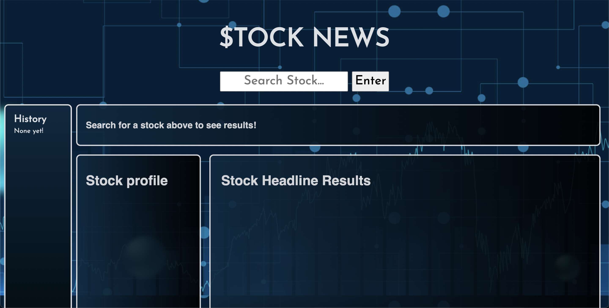

# $tock News 

## Description

This repository ("Project1_Group10") is where we (Sam Gates, Nelson Johns, and Thang Nguyen) develop the [$tock News](https://ntjohns1.github.io/Project1_Group10/) web application. 

[$tock News](https://ntjohns1.github.io/Project1_Group10/) provides the user with a simplistic way to check for current stock market prices and view recent news articles from various outlets relating to that stock. This lightweight application offers the user a quick and realtime resource/tool for market research or analysis. We aim to offer a straight forward and responsive interface across different browsers and devices for ease of accessibility. 

Our web application incorporates third party APIs for the primary functions, namely FinnHub.io and Currents API. We also included a history sidebar for the user to keep track of and quickly access previous stock searches. 

## Usage

When the page loads, the user is presented with a page titled "$TOCK NEWS" with a search bar located at the top of the page. On the left hand side, there is a history section that displays past results. If there are none, a default message is displayed. The page displays default headers in each content section. The top header invites the user to "search for a stock above to see results!"

The search input is based on stock symbol. If a company name or description is entered, the app will attempt to generate a list with suggested companies. If no data is returned, the user is invited to search again using a symbol. All searches are added immediately to the search history list, which is preserved in local storage. The list is easily cleared by clicking the "clear history" button. 

Once a proper symbol is entered, the user will see three content sections populated with data unique to that company. All stock data is retrieved using FinnHub.io's API. Stock quotes are real time. All news information displayed utilizes the Currents API. 

In the top section, the user will see current (or last close) price data, including the current price, intra-day high, intra-day low, and the previous close price. On the bottom left, the user will see the company's logo (if available), and a short company profile. This data section includes the country, industry, market capitalization, shares outstanding, and ticker symbol. Beneath that are three basic financial metrics: 52 week high, 52 week low, and beta. Beta, as defined by Investopedia.com, is "a measure of the volatility-or systematic risk-of a security or portfolio compared to the market as a whole." 

Please view the demonstration of the app's functionality in the screenshots below. 

link to slide deck: https://docs.google.com/presentation/d/1tBemtFiU1niTex7wCpX43be8HQBd-qQcWXBWaDp_djM/edit#slide=id.p

## Credits

### Collaborators
[Sam Gates](https://github.com/sg0703) 
[Nelson Johns](https://github.com/ntjohns1)
[Thang Nguyen](https://github.com/thangnt336)

### Third Party Developers
[PureCSS](https://purecss.io/)
[FinnHub.io](https://finnhub.io/docs/api)
[CurrentsAPI](https://currentsapi.services/en)
[jQuery](https://jquery.com/)
